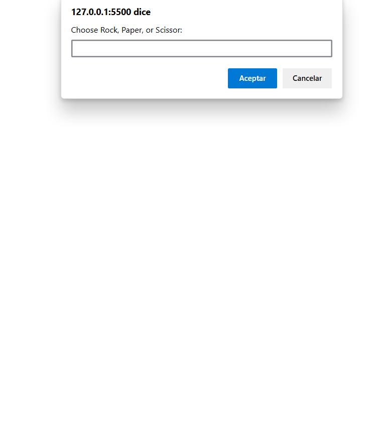

# Project Name

The game of rock, paper, scissors

     

This project about the game of rock, paper or scissors

## Built With

- visual studie code

## Live Demo

[Live Demo Link]( https://rafaelb056.github.io/Project-Rock-Paper-Scissors/)

## Getting Started

**This is an example of how you may give instructions on setting up your project locally.**
**Modify this file to match your project, remove sections that don't apply. For example: delete the testing section if the currect project doesn't require testing.**

## Como hacer una copia en local

### ir al repositorio del github

### copiar el codigo de http

### y hacer un git clone en una terminal de linux o en git bash

### cuando ya  este clonado abrilo con visual studio code

## Authors

👤 **Rafael Benitez Enriquez Gonzales**

- GitHub: [@rafaelb056](https://github.com/rafaelb056)

## 🤝 Contributing

Contributions, issues, and feature requests are welcome!

Feel free to check the [issues page](https://github.com/rafaelb056/test_to_flexbox/issues).

## Show your support

muchas gracias por el apoyo

## Acknowledgments

-  gracias al profesor aristides

## 📝 License

This project is [CC0 1.0 Universal](LICENSE) licensed.